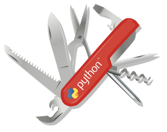
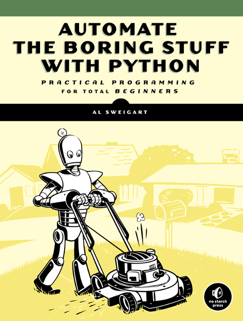

Python: the Multi-tool for System Management <!-- .element: class="r-fit-text" -->

 <!-- .element: class="hero" -->

Notes:

Welcome. I am Jonathan Bowman. I am a data engineer by day, a hobbyist developer all the time, and I have some experience in IT, in web development, teaching, and consulting.

---

Learn, customize, tear down, build <!-- .element: class="r-fit-text" -->

[ <!-- .element: class="hero" -->][c64] 

[c64]: https://en.wikipedia.org/wiki/Commodore_64

Notes:

My computer history started in 1982 when my family got a Commodore 64 for Christmas. My parents only bought us two educational games, so we kids were left with blinking cursor and the BASIC programming language. Which was perfect! That computer became a place to experiment, learn, customize, build, tear down, build again. It was an entire world to constantly explore.

---

<!-- .slide: data-background-image="assets/pyrepl.gif"  -->

Notes:

Decades later I found the Python REPL (Read Evaluate Print Loop or just the prompt) to be the same: approachable, powerful, available. A place to experiment, tear down, build again. (No production filesystems were harmed in the making of this presentation)

I did not go straight from the Commodore to Python. The path to get there involved the open source landscape.

---

<!-- .slide: data-background-image="assets/oldrag.jpg" -->

 <!-- .element: class="hero fragment fade-up" -->

Notes:

From the Commodore in the 80s, fast forward to 1999, finishing my Bachelor's degree so I could be a high school English teacher, and I heard about Linux. Discovering Linux and open source was like cresting a hill and seeing this infinite landscape stretched out (with key features highlighted). Information was freely available, and the tools were attainable.

---

<!-- .slide: data-background-image="assets/holding-hands.svg" data-background-size="85%" -->

Notes:

I became a middle and high school teacher, bringing with me that re-kindled interest in building digital things. Ever since then I have continued to develop and build on my own, building and tearing down my machines and homelab. But I quickly found that this vast open source landscape provided plenty of natural resources for _helping others_. I evolved into being an IT technician at the school where I worked. Thrived on responding to others' needs and questions, pointing them to freely available tools. Configuring servers, desktops, web pages to support the adventures that my co-workers and students were on.

---

Hindered by tasks that are

- taking too much time
- hard to remember
- prone to human error

Notes:

This helping others is often hindered by tasks that are

- taking too much time
- hard to remember
- prone to human error


Thus the desire for automation! To improve efficiency, repeatability, and reliability.

All of these are quite desirable with Linux system administration, configuration, whether you are working with an Ubuntu laptop, an Open-WRT router, a datacenter with hundreds of RHEL VMs, or your Archlinux-based homelab. And, yes, even other platforms.

---

Different tools for system automation

- Bash <span class="fragment" data-fragment-index="2">(or ash/dash, zsh, fish, Elvish, xonsh, Nushell...)</span>
- Python <!-- .element: class="fragment fade-left" data-fragment-index="3" style="color: #0c9"-->
- Ansible <span class="fragment" data-fragment-index="1">(or Salt, Chef, Puppet...)</span>

Notes:

When considering system automation in the open source world, I immediately think of two classes of tools: represented well by bash and Ansible (and similar shells and tools)

Both Bash and Ansible can automate tedious tasks. Ansible is more readable and shareable. A Bash script has less guardrails, and is useful for more than just configuration management.

I think Python occupies a middle place between these two. It can be used to do anything Ansible does and it can do anything Bash does, but unlike either of these, it is a general-purpose programming language with a multi-faceted ecosystem.

__None of these are the right tool for _every_ job. There are always going to be tasks that are best with one or the other, or something else entirely.__

---

Use Python when:

- Bash scripts are too large, complicated
- Processing complex string, array, or data
- Target machine lacks required commands
- Ansible is too heavy, slow, simple, or unavailable
- Cross-platform is desirable
- Already know or want to learn Python

[An informative debate about the merits of Bash vs. Python on Stackoverflow](https://stackoverflow.com/questions/2424921/python-vs-bash-in-which-kind-of-tasks-each-one-outruns-the-other-performance-w)

Notes:

(Walk through points)

Keep in mind: Python works well with Bash and with Ansible. This isn't an either/or choice. Also note an interesting discussion on Stackoverflow.

---

Why Python (and not other general-purpose languages)?

It isn't a competition; collect them all! <!-- .element class="fragment fade-in" -->

Notes:

Many scripting languages exist that fill this space: Perl is the old standby, Ruby and even Javascript can be used. Lua is probably worth exploring!

If you find something that works as well as Python, excellent!

If you are weighing options, a couple quotes to consider:

---

"The Python space is beautiful, and great, and big"

Lorena Mesa, Engineer at GitHub, former chair of Python Software Foundation <!-- .element class="fragment fade-in" -->

Notes:

From Github's README project. Lorena in turn quotes Brett Cannon.

---

"I came for the language, I stay for the community."

Brett Cannon, Dev lead on the Python extension for Visual Studio Code <!-- .element class="fragment fade-in" -->

---

"batteries included"

 <!-- .element: class="hero" -->

Notes:

The standard library is huge. Lots of built-in functionality.

---

Getting started with Python

Lots of good documentation. Here are a few options...

Notes:

Some suggestions for learning Python (all free):

---

[ <!-- .element: class="hero" -->][boring]

[boring]: https://automatetheboringstuff.com/

---

[ <!-- .element: class="hero" -->][djangogirls]

[djangogirls]: https://tutorial.djangogirls.org/en/

---

[][pythondocs]

[pythondocs]: https://docs.python.org/3/

---

[ <!-- .element style="height: 10vh" -->][awesomepython] <br>
[Awesome Python][awesomepython]</br>
List

[awesomepython]: https://awesome-python.com/

---

 <!-- .element: class="hero" -->

---

<!-- .slide: data-background-image="assets/pyhelp.gif"  -->

---

Installing Python

---

<!-- .slide: data-background-image="https://imgs.xkcd.com/comics/python_environment.png" data-background-size="contain"  -->

Notes:

- Python installation and management can be confusing, but it doesn't need to be

---

- [python.org/downloads/][downloads]
- Linux: 
	* Debian/Ubuntu: `apt install python3`
	* Fedora: `dnf install python3`
- Docker: `docker run -it python:alpine`
- Phones: Termux (Android) or Pythonista (iOS)
- Mac: see [downloads] or `brew install python`
- Windows: see [downloads] or Store or scoop/chocolatey/winget

[downloads]: https://www.python.org/downloads/

Notes:

- If unsure, just download the distro for your machine
- If on Linux, there is likely a python3 package in your repository
- scoop.sh: a gentle on-ramp to open source software

---

Making `python` launch `python3`?

- python-is-python3 (Ubuntu/Debian)
- pythonispython3 (Alpine)
- python-unversioned-command (Fedora)
- `alias python=python3`

Notes:

Linux package repos typically label python as python3, and python is launched as python3 although most distros have ways of making python launch python3, such as python-is-python3 (Ubuntu), pythonispython3 (Alpine), python-unversioned-command (Fedora) or shell config (.bashrc). Surely this need will go away the further we are from Python 2

---

Python REPL on the web:

- [pythonanywhere.com](https://www.pythonanywhere.com/)
- [python.org/shell](https://www.python.org/shell/)
- [github.com/codespaces](https://github.com/codespaces/)
- [repl.it/languages/python3](https://replit.com/new/python3)
- [paiza.cloud](https://paiza.cloud/)
- [c9.io](https://aws.amazon.com/cloud9/)

Notes:

There are options for Python on the web. In no particular order

---

Installing packages

```terminal
> pip install requests
> pip install plumbum httpx sqlalchemy
```

Browse at [pypi.org](https://pypi.org)

Notes:

How to install packages: with pip. Singly or several at once..

---

Virtual environments

```terminal
> python3 -m venv virtual_directory_name
> python3 -m venv .venv
> . .venv/bin/activate
```

Notes:

If you want to play around with installing python packages, a virtual environment is recommended.

Create a directory, then activate it. Easy to just delete the virtual env directory afterward and start fresh.

Docker could be used in place of this.

---

Python editors

- [VSCode](https://code.visualstudio.com/)
- [PyCharm](https://www.jetbrains.com/pycharm/)
- Vim/Neovim, Emacs, Sublime Text, Helix, Zed...
- For beginners: [Thonny](https://thonny.org/), [Mu](https://codewith.mu/)

Notes:

- More than likely, the editor of your choice has good Python support; you may need to install a plugin/extension
- If in doubt, use what you already are familiar with, or just use VSCode

---

Lightning intro to writing Python

[github.com/bowmanjd/olf22python](https://github.com/bowmanjd/olf22python)

 <!-- .element: class="hero" -->

Notes:

Lightning intro to Python: see examples in the repo.

---

Functions and their arguments

---

```python [1-5|1-2|5|1-5]
def greet(greeting):
    return greeting + ", World!"


greet("Hello")
```

Notes:

`def` defines a function. This function is named `greet` and takes one argument that is assigned to the variable `greeting`. `return` specifies the return value of the function. Also note one way to do string concatenation, with the plus operator.

---

Default arguments

```python [1-5|1|5|1-5]
def greet(greeting="Hello"):
    return greeting + ", World!"


greet()
```

Notes:

Default arguments can be specified. Here we make the argument `greeting` have a default string of "Hello"

---

Named arguments and f-strings

```python [1-7|6-7|2|1-7]
def greet(greeting="Hello", audience="World"):
    return f"{greeting}, {audience}!"


greet()
greet("Salutations", "Galaxy")
greet(audience="Galaxy")
```

Notes:

- When calling a function, you can use positional and/or named arguments
- Also note the cooler way to use variables in strings: the f-string

---

Some types

```python [1-9|1|2|3|4|5|6|7|8|9|1-9]
a_number = 12
another_number = 7.1
a_string = "Some text"
another_string = "Some more text"
a_range = range(10)
some_bytes = b"\x00\x01\x02\x03Hi"
a_list = ["Some text", 14, another_number, "你好", 1]
a_lonely_number = a_list[4]
a_boolean = True
```

Notes:

- step through types

---

The dict

```python [1-5|5|3|1-5]
a_dict = {"a_key": "a_value",
          "first_name": "Sheila",
          "pi": 3.14159}

archimedes_constant = a_dict["pi"]
```

Notes:

The dict. A hash type. Or a mapping. Or an associative array. Named values... 

Get a value by name.

---

Comparisons and conditions

```python
def compare(a, b):
    if a == b:
        print("equality")
    if not a == b:
        print("inequality")
    if a != b:
        print("also inequality")
    if a > b:
        print("greater than")
    else:
        print("less than or equal")
    if a <= b:
        print("also less than or equal")
```

Notes:

Various comparison operators, that work on a variety of types, not just numbers.

---

Loops

```python [1-13|3-4|6-7|9-10|12-13|1|1-13]
import os

for variable in os.environ.keys():
	print(variable)

for path in os.getenv("PATH").split(":"):
	print(path)

for num in range(10):
	print(num)

for _ in range(10):
	print("Doing this thing 10 times.")
```

Notes:

Loops over am iterable (collection or range). (Review examples)

---

Shell scripting in the standard library

- [`subprocess`](https://docs.python.org/3/library/subprocess.html) for command execution
- [`pathlib`](https://docs.python.org/3/library/pathlib.html) for filesystem reading/manipulation
- [`shutil`](https://docs.python.org/3/library/shutil.html) for copying/deleting directories
- [`shlex`](https://docs.python.org/3/library/shlex.html) for parsing arguments
- [`re`](https://docs.python.org/3/library/re.html) for regular expressions
- [`fnmatch`](https://docs.python.org/3/library/fnmatch.html) for shell-like file matching
- [`argparse`](https://docs.python.org/3/library/argparse.html) for parsing command-line arguments
- [`os`](https://docs.python.org/3/library/os.html) 
- [`sys`](https://docs.python.org/3/library/sys.html)

Notes:

Summarizing shell scripting libraries included in Python. We will go into more detail on some, but not all, of these.

---

Data wrangling in the standard library

- [`csv`](https://docs.python.org/3/library/csv.html)
- [`json`](https://docs.python.org/3/library/json.html)
- [`xml.etree.ElementTree`](https://docs.python.org/3/library/xml.etree.elementtree.html) (consider [defusedxml](https://github.com/tiran/defusedxml))
- [`sqlite`](https://docs.python.org/3/library/sqlite.html)
- [`urllib.request`](https://docs.python.org/3/library/urllib.request.html) for HTTP calls

Notes:

- Some data handling libraries included in Python
- mention XML bombs

---

The heart of shell scripting in Python:

command execution with `subprocess`

Notes:

Let's talk about subprocess

---

`subprocess.run()` with text output capture

```python
import subprocess

result = subprocess.run(["ip", "addr"],
                        capture_output=True,
                        text=True)

if result.returncode == 0 and result.stdout:
	print(result.stdout)
```

Notes:

subprocess.run can be used to do anything. Many options. Here it captures text output, tests for success. Note the list of arguments, the recommended way of passing commands. The first one, `ip` in this case, is the command itself. Subsequent items are the arguments passed to that command.

---

The same, but with shell mode (be careful)

```python
import subprocess

result = subprocess.run("ip addr",
                        capture_output=True,
                        shell=True,
                        text=True)

if result.returncode == 0 and result.stdout:
  print(result.stdout)
```

Notes:

Can run a shell command verbatim, including variable and tilde expansion. But beware of untrusted user inputs (`; rm -rf /`)

---

A shortcut with `subprocess.check_output`

```python
import subprocess

output = subprocess.check_output(["ip", "addr"],
                                 text=True)

print(output)

```
Notes:

check_output shortcut (don't have to specify capture, nor pull stdout)

---

A shortcut with `subprocess.check_call` if output capture is not needed

```python
import subprocess

subprocess.check_call(["ip","addr"])
```

---

- `subprocess.run` for anything and everything
- `subprocess.check_output` for convenience, capturing output
- `subprocess.check_call` if execution is all that is needed
- `shell=True` parameter will pass the whole command as string to `sh`, and expand variables (security alert); otherwise pass the command as a `["list", "of", "command", "and", "parameters"]`

Notes:

- summary slide

---

SSH

with [Paramiko](https://www.paramiko.org/) 

---

```python
import paramiko

client = paramiko.SSHClient()
client.load_system_host_keys()
client.connect("server", username="user")

stdin, stdout, stderr = client.exec_command('ls /')
root_directories = stdout.read()

sftp = client.open_sftp()
with sftp.file("/etc/os-release") as f:
  for line in f:
    print(line)
```

Notes:

Paramiko example. A little involved, but not too bad. However, doesn't read SSH config very easily.

---

Have you tried [plumbum](https://plumbum.readthedocs.io)?

```python
from plumbum.cmd import ip

ip('addr')
```

And *so* much more...

Notes:

Plumbum. This is a library I am getting to know. If you were serious about using Python for all your shell scripting needs, I think you want to get to know plumbum, too. Import executables from the PATH easily...

---

Such as SSH:

```python
from plumbum import SshMachine

server = SshMachine("server", user="admin")
server["uname"](['-a'])
```

Notes:
Easy SSH. Just uses the OpenSSH binary under the hood, so everything just works.

---

Other SSH options

- [AsyncSSH](https://asyncssh.readthedocs.io/)
- [fabric](https://www.fabfile.org/)
- `ssh server python3 < script.py`

Notes:

Other SSH options. If you are familiar with async/await syntax with Python or other languages, consider AsyncSSH.

Fabric is built on Paramiko with easier support for SSH config files.

But just using SSH is also an option, especially if Python is on the target machine

---

File reading, writing, and manipulation with

`pathlib`

---

```python [1-11|1|3|4|9|10-11|1-11]
from pathlib import Path

filepath = Path("/etc/os-release")
os_info = filepath.read_text()
if "Fedora" in os_info:
	print("I still remember Redhat 5.1")
elif "Alpine" in os_info:
  print("Compiled with love and musl")
elif "archlinux" in os_info:
  print("A wiki and the AUR; it "
	      "doesn't get better than this!")
```

Notes:
- importing into global namespace
- the path object
- the convenient read_text function
- Note the `elif`
- breaking up a long string

---

Reading line by line

```python [1-7|4-7|5|1-7]
from pathlib import Path

filepath = Path("/etc/os-release")
with filepath.open() as f:
  for line in f:
    if line.startswith("PRETTY_NAME"):
      print(line.strip())
```

Notes:

`with` creates a context in which you can do things with a temporarily opened entity, and trust that it will close when you are done.

If you run this, it should output a line with your distro name on it.

---

```python
import pathlib
import shlex

os_release_file = pathlib.Path("/etc/os-release")
os_release = os_release_file.read_text()
lexer = shlex.shlex(os_release, posix=True)
lexer.whitespace_split = True
os_info = dict(i.split('=') for i in lexer if "=" in i)
print(os_info["PRETTY_NAME"])
```

Notes:

- Just an example of combining file operations with the shlex module
- shlex parses shell-like syntax safely
- such as a file that might be sourced by Bash, like /etc/os-release

---

Writing text to a file

```python
from pathlib import Path

filepath = Path("/etc/motd")
weather = "There will be temps today with a chance of weather."
filepath.write_text(weather)
```

Notes:

Writing text with pathlib is as easy as reading it. Here we write a message of the day.

---

Processing command-line arguments

---

Easy but inflexible with `sys.argv`

Save the following to something like `motder.py`

```python
import sys
from pathlib import Path

def motder(text):
  filepath = Path("/etc/motd")
  filepath.write_text(text)

if __name__ == "__main__":
	motder(sys.argv[1])
```

Execute with:

```terminal
> sudo python3 motder.py "Good morning it is Friday!"
```

---

Add a shebang and make it executable

```python [1-10|1|1-10]
#!/usr/bin/env python3
import sys
from pathlib import Path

def motder(text):
  filepath = Path("/etc/motd")
  filepath.write_text(text)

if __name__ == "__main__":
	motder(sys.argv[1])
```

```terminal
> chmod a+x motder.py
> sudo ./motder.py "Good morning it is a lazy Friday!"
```

Notes:

In case it is too tedious to write "python3" first.

So, we wrote a program that takes arbitrary text as an argument, then writes it to the message of the day. But what if there are multiple arguments, or none, or if the user wants help? Well, there are more flexible options.

---

A more flexible way: `argparse`

```python
#!/usr/bin/env python3
import argparse
from pathlib import Path

def motder(text):
  filepath = Path("/etc/motd")
  filepath.write_text(text)

if __name__ == "__main__":
  parser = argparse.ArgumentParser()
  parser.add_argument("message", help="The message of the day")
  args = parser.parse_args()
	motder(args.message)
```

Notes:

In the standard library, there is a nice argument parser called argparse. Try executing without an argument, or with motder.py -h (builtin help)

---

Some excellent third-party CLI libraries

- [`click`](https://palletsprojects.com/p/click/)
- [`typer`](https://typer.tiangolo.com/)
- [`fire`](https://google.github.io/python-fire/)
- [`plumbum`](https://plumbum.readthedocs.io/en/latest/cli.html#command-line-interface-cli)

Notes:

While argparse is great, you may find some external libraries desirable for ease of use and even more features. And, yes, plumbum to the rescue again.

---

Create truly glamorous TUIs

- [`rich`](https://rich.readthedocs.io/)
- [`textual`](https://textual.textualize.io/)

Notes:

For terminal output that is glamorous, you can try these libraries (rich has been around longer. textual the new hotness. Written by the same person)

---

Temporary files

```python
import pathlib
import shutil
import subprocess
import tempfile

tempdir = pathlib.Path(tempfile.mkdtemp())
temp_motd = tempdir / "motd"
temp_motd.write_text("Welcome, user!")
motd = pathlib.Path("/etc/motd")
subprocess.check_call(["sudo", "cp", temp_motd, motd])
shutil.rmtree(tempdir, ignore_errors=True)
```

Notes:

Python also has ability to handle temporary files. This is quite useful when editing a file in place.

---

Data

Notes:

There is a broad and deep Python ecosystem around data manipulation. Here are a few helpers that are builtin.

---

Writing JSON

```python[1-5|1|3|4|1-5]
import json

data = {"name": "OLF conference", "age": 20}
json_data = json.dumps(data, indent=4)
print(json_data)
```

Notes:

- The JSON module can turn many Python objects, lists, or strings into JSON.
- line 3 is not JSON, even though it looks like it!
- indent is entirely optional

---

Reading JSON

```python[1-6|6|1-6]
import json
from pathlib import Path

filepath = Path("/etc/docker/daemon.conf")
filetext = filepath.read_text()
dockerd_conf = json.loads(filetext)
```

Notes:

And can deserialize JSON as well, converting it to Python objects. Here we load the config for the docker service.

---

Reading CSV

---

`sample.csv`

```text
Name,Age
Michael Palin,79
John Cleese,83
OLF Conference,20
```

Notes:

This is what a simple CSV file looks like.

---

```python
import csv
from pathlib import Path

inpath = Path("sample.csv")

with inpath.open(newline="", encoding="utf-8") as f:
    reader = csv.reader(f)
    next(reader) # Skip the header
    for row in reader:
        name = row[0]
        age = row[1]
        print(f"{name} is {age} years old.")
```

Notes:

We can read that file row by row and then parse the fields in the row.

---

```python
import csv
from pathlib import Path

inpath = Path("sample.csv")

with inpath.open(newline="", encoding="utf-8") as f:
    reader = csv.DictReader(f)
    for row in reader:
        name = row["Name"]
        age = row["Age"]
        print(f"{name} is {age} years old.")
```

Notes:

There is also the ability to read each row as a dictionary, so you can always address the columns by the header (this assumes a header row, of course).

---

Writing CSV

```python
import csv
from pathlib import Path

out = Path("output.csv")

with out.open("w", newline="", encoding="utf-8-sig") as f:
    writer = csv.writer(f)
    writer.writerow(["Name", "Age"])
    writer.writerow(["John Cleese", 83])
```

Notes:

Writing is similar to reading. Able to write line by line.

---

Web requests

---

GET some data

```python
from urllib.request import urlopen

# Avoid unsanitized user inputs, because:
# url = "file:///etc/passwd"
url = "https://wttr.in/Columbus,OH?A1nF"
with urlopen(url) as response:
  print(response.read().decode())
```

Notes:

There are really good third party http client libraries out there, but the one that is included with Python can work well, too. Be careful with user provided URLs, though! At least check if url startswith('http'). Also note that the response is returned as bytes, which you may which to decode as a string.

---

POST some JSON

---

```python [1-16|10|12-13|16|1-16]
import json
from urllib.request import Request, urlopen

url = "https://jsonplaceholder.typicode.com/posts"
data = {
    "userid": "1001",
    "title": "POSTing JSON for Fun and Profit",
    "body": "JSON! Don't forget the content type.",
}
postdata = json.dumps(data).encode()
headers = {"Content-Type": "application/json"}
httprequest = Request(url, method="POST",
                      data=postdata, headers=headers)

with urlopen(httprequest) as response:
    print(response.read().decode())
```

Notes:

- jsonplaceholder __simulates__ a post

---

Third-party libraries for Web

- [`requests`](https://requests.readthedocs.io/)
- [`httpx`](https://www.python-httpx.org/)
- [`BeautifulSoup`](https://beautiful-soup-4.readthedocs.io/)
- [`scrapy`](https://scrapy.org/)

Notes:

Some external libraries you may wish to explore. requests is exceedinly popular http client, httpx is my favorite, BeautifulSoup or scrapy are excellent for actually parsing HTML if web scraping is your thing.

---

Other data avenues to explore

- built-in [`sqlite`](https://docs.python.org/3/library/sqlite.html)
- [`xml.etree.ElementTree`](https://docs.python.org/3/library/xml.etree.elementtree.html) or [defusedxml](https://github.com/tiran/defusedxml) or [`lxml`](https://lxml.de/)
- [`SQLAlchemy`](https://www.sqlalchemy.org/)
- [`pandas`](https://pandas.pydata.org/)
- [`numpy`](https://numpy.org/)

Notes:

point by point

---

For network engineers

- [Netmiko](https://pynet.twb-tech.com/blog/automation/netmiko.html): switch management
- [Napalm](https://napalm.readthedocs.io/): network automation
- [Nornir](https://nornir.readthedocs.io/): automate everything 
- [Free Python Network Automation Course](https://pynet.twb-tech.com/) from Twin Bridges Technology

Notes:

- Hold still while I throw a lot of links at you. Just in case something here is a path worth exploring for your needs.
- Network engineers. Also note that nornir is more general purpose, similar to fabric, in that it is like Ansible, but you use the full strength of Python rather than a DSL.

---

For virtualization

- [proxmoxer](https://proxmoxer.github.io/docs/)
- [libvirt]
- [AWS SDK for Python](https://aws.amazon.com/sdk-for-python/)
- [Azure SDKs for Python](https://azure.github.io/azure-sdk-for-python/index.html)
- [Google Cloud Client Libraries](https://cloud.google.com/python/docs/reference/)
- [vSphere Automation SDK](https://github.com/vmware/vsphere-automation-sdk-python)
- [VMware ESXi/vSphere API Python Bindings](https://github.com/vmware/pyvmomi)
- For Hyper-V: [pywinrm](https://github.com/diyan/pywinrm) WinRM client
- For Hyper-V: [pypsrp](https://github.com/jborean93/pypsrp) PowerShell Remoting

[libvirt]: https://www.libvirt.org/docs/libvirt-appdev-guide-python/en-US/html/

Notes:

- For the most part, your cloud provider or hypervisor likely has a Python SDK!

---

For container management

- [docker](https://docker-py.readthedocs.io/)
- [podman](https://github.com/containers/podman-py) (if using socket)
- [kubernetes](https://github.com/kubernetes-client/python)

Notes:

- podman package is for using the API through the podman socket

---

Thank you <!-- .element: class="r-fit-text" -->

Notes:

Thank you. Questions? Opinions? Good arguments we can have with one another?
